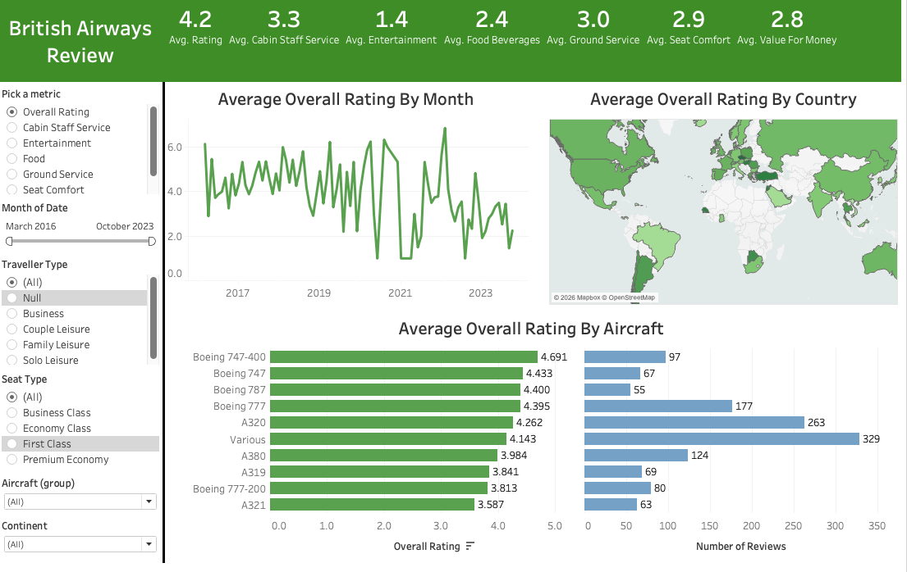

# British Airways Customer Experience Analysis (Tableau Project)

## Project Overview

This Tableau project analyzes customer review data to evaluate the key factors influencing customer experience with British Airways. The dashboard is designed to provide an interactive and data-driven view of service performance across multiple dimensions, including geography, aircraft type, traveler profile, and time trends.

The goal of this project is to transform raw review data into actionable insights through dynamic filtering, parameter-driven metric selection, and structured dashboard design.

To see the full interactive dashboard on Tableau, follow this link:  
(https://public.tableau.com/views/BritishAirwaysReview_17725115852250/Dashboard1?:language=en-US&:sid=&:redirect=auth&:display_count=n&:origin=viz_share_link)

---

## Dashboard Preview

---

## Data Source

- British Airways review dataset  
- Country dataset  
- Data sourced from the repository of Mo Chen  

---

## Skills & Tools Used

- Tableau Dashboard Development  
- Data Visualization  
- Interactive Parameter Creation  
- KPI Design and Layout Optimization  
- Dynamic Filtering and Cross-Filtering  
- Time Series Trend Analysis  

---

## Interactive Features

### Parameter: "Pick a Metric"

A dynamic parameter titled **Pick a Metric** allows users to toggle between different performance indicators. This selection updates all KPI cards and visualizations across the dashboard in real time.

### Filters

The dashboard includes the following filters:

- Month of Date  
- Traveller Type  
- Seat Type  
- Aircraft  
- Continent  

These filters enable users to segment the data and analyze performance across different customer groups and operational variables.

---

# Project Structure

The project is divided into five key components, with four primary visualizations combined into a final integrated dashboard.

---

## Part 1: Map Visualization

An interactive world map displays customer ratings by geographic location.

Users can dynamically switch between metrics such as:

- Overall Rating  
- Cabin Staff Rating  
- Traveller Type  
- Seat Type  

This visualization highlights regional differences in customer satisfaction and service performance.

---

## Part 2: Summary Sheet

The summary sheet presents high-level KPI metrics, including:

- Overall Rating  
- Cabin Staff Service  
- Entertainment  
- Food and Beverages  
- Ground Service  
- Value for Money  

This section provides a consolidated performance snapshot for quick executive-level insights.

---

## Part 3: Monthly Trends

A time-series line chart tracks the average of selected metrics by month.

This visualization enables users to:

- Identify seasonal trends  
- Detect performance fluctuations over time  
- Evaluate consistency in service delivery  

---

## Part 4: Aircraft Analysis

Two horizontal bar charts provide aircraft-level insights:

- Aircraft Type vs. Average Overall Rating  
- Aircraft Type vs. Number of Reviews  

This analysis identifies which aircraft models are associated with higher customer satisfaction and which receive the highest review volume.

---

## Part 5: Final Dashboard

All visualizations are integrated into a single, cohesive dashboard designed for cross-filtering and dynamic exploration.

The final dashboard enables users to:

- Switch between performance metrics  
- Segment customer feedback by traveler and seat type  
- Analyze geographic trends  
- Evaluate aircraft-level performance  
- Monitor changes in satisfaction over time  

---

## Business Impact

This project demonstrates the ability to:

- Translate raw customer review data into structured insights  
- Design parameter-driven, interactive dashboards  
- Apply user-focused dashboard architecture  
- Deliver executive-ready KPI reporting  
- Support data-driven decision-making through visualization  

